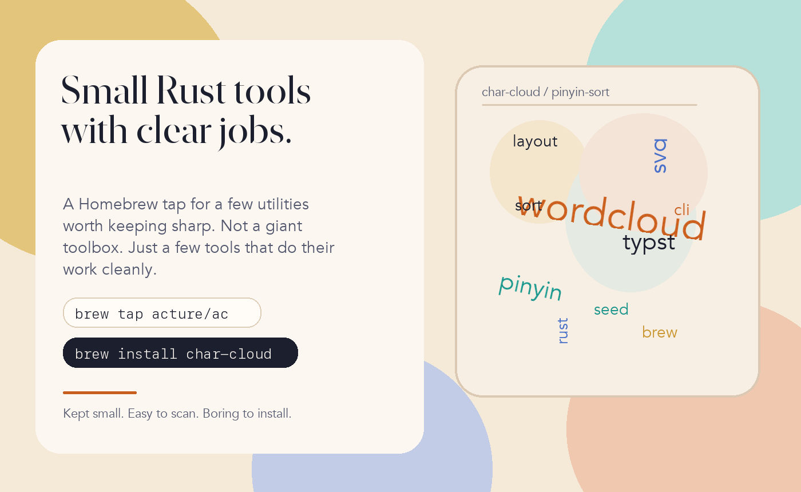
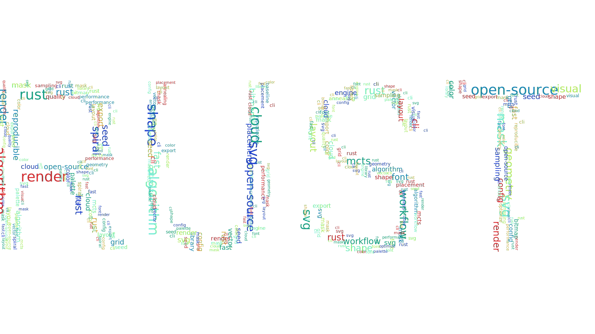

<div align="center">
  <p><sub>Acture / homebrew-ac</sub></p>
  <p>
    <a href="https://github.com/Acture/homebrew-ac/actions/workflows/brew-ci.yml"></a>
    <a href="LICENSE"></a>
    
  </p>
  <h1>Small Rust tools with clear jobs.</h1>
  <p><strong>A Homebrew tap for a few utilities worth keeping sharp.<br>Not a giant toolbox. Just a few tools that do their work cleanly.</strong></p>
  <p>
    
  </p>
</div>

## Install

```bash
brew tap acture/ac
brew install char-cloud
```

Direct installs also work: `brew install acture/ac/<formula>`.

## What's in this tap

### `char-cloud`

Shape-aware SVG word clouds for reports, demos, and other places where plain text should end up as something inspectable.



Install: `brew install char-cloud`  
Upstream: [Acture/char-cloud](https://github.com/Acture/char-cloud)

```bash
char-cloud \
  --text "ACTURE" \
  --word-file words.txt \
  --algorithm fast-grid \
  --seed 7 \
  --output cloud.svg
```

### `pinyin-sort`

```text
before
张三
李四
王五

after
李四
王五
张三
```

Sort Chinese text lists into predictable Hanyu Pinyin order for publishing, cleanup, and low-drama review passes.

Install: `brew install pinyin-sort`  
Upstream: [Acture/pinyin-sort](https://github.com/Acture/pinyin-sort)

## Also in this tap

### `d2typ`

Turn CSV, JSON, YAML, TOML, or XLSX into Typst-ready data when a document pipeline needs one less manual step.

Install: `brew install d2typ`  
Upstream: [Acture/d2typ](https://github.com/Acture/d2typ)

```bash
$ d2typ examples/d2typ/input.json -o out.typ
$ cat out.typ
#let data = {count: 3, items: [svg, typst, pinyin], ready: true}
```

## Why this tap exists

This tap stays small on purpose. The formulae here do narrow jobs, produce output that can be checked quickly, and keep installation boring.

- Tracks tagged upstream releases.
- CI audits the tap and verifies the stable install set.
- Smoke tests validate real output, not just `--version`.

## License

This tap is distributed under the [AGPL-3.0-only](LICENSE) license.
