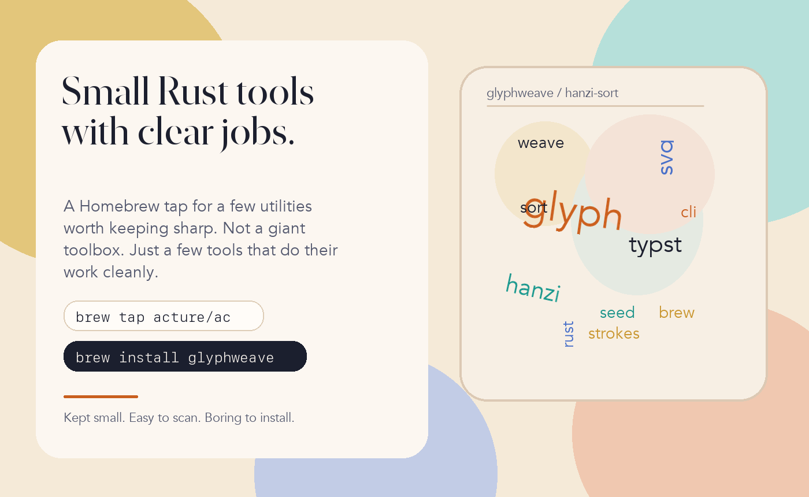
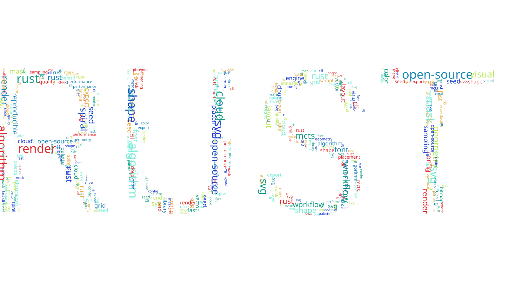

<div align="center">
  <p><sub>Acture / homebrew-ac</sub></p>
  <p>
    <a href="https://github.com/Acture/homebrew-ac/actions/workflows/brew-ci.yml"></a>
    <a href="LICENSE"></a>
    
  </p>
  <h1>Acture software on Homebrew.</h1>
  <p>A shared tap for command-line tools and future macOS apps.</p>
  <p></p>
</div>

## Install

Use the full formula name:

```sh
brew install acture/ac/scriptmark
```

| Software | Purpose | Channel | Install |
| --- | --- | --- | --- |
| [docpack](https://github.com/Acture/docpack) | Generate Typst and LaTeX data modules | Stable source | `brew install acture/ac/docpack` |
| [glyphweave](https://github.com/Acture/glyphweave) | Generate shape-aware SVG word clouds | Stable source | `brew install acture/ac/glyphweave` |
| [hanzi-sort](https://github.com/Acture/hanzi-sort) | Sort Chinese text by pinyin or stroke count | Stable source | `brew install acture/ac/hanzi-sort` |
| [reviewloop](https://github.com/Acture/reviewloop) | Manage paper review submissions and retrieval | Stable source | `brew install acture/ac/reviewloop` |
| [ScriptMark](https://github.com/Acture/scriptmark) | Grade student programming assignments | Stable binary | `brew install acture/ac/scriptmark` |
| [Stepwise](https://github.com/Acture/Stepwise) | Practice Python evaluation and propositional logic | Development source | `brew install --HEAD acture/ac/stepwise` |
| [Foch](https://github.com/Acture/foch) | Analyze and merge EU4 mods; run an LSP server | Development source | `brew install --HEAD acture/ac/foch` |
| [Teaser](https://github.com/Acture/teaser) | Native macOS workspace and panel manager | Pending cask | See the [cask template](packaging/templates/Casks/teaser.rb.in) |

ScriptMark tracks the published v0.2.0 assets, with their release SHA256 digests,
and includes Python 3.13 for the Python execution backend. Its upstream development
branch contains newer work; installing this formula does not install that branch.

Stepwise and Foch have no published stable release yet. Their `--HEAD` formulae
build the latest `master` and can change between installations. Source downloads
exclude private notes. Foch fetches only its pinned public grammar and CWT schema
submodules, and embeds the schema into the CLI.

Teaser is registered here as a release template. Before enabling
`brew install --cask acture/ac/teaser`, upstream must isolate its inherited Herdr
runtime namespace and ship a complete, signed App bundle with a fixed download
URL and checksum. The template is outside `Casks/` so Homebrew does not advertise
an unavailable package. Stepwise and Foch desktop apps also await release assets.

## Debian and Ubuntu

A signed APT source for Debian 13 and Ubuntu 24.04, on amd64 and arm64, is
prepared for GitHub Pages. Its initial devtunnel-service release and first
deployment are pending. See the [APT source guide](docs/apt-source.md) for the
reviewed signing fingerprint, publication gates and installation commands.

## Examples

```sh
docpack emit input.json --backend typst
stepwise --python '1 + 2 * 3' --trace
foch input inspect ./foch.toml
```



```sh
glyphweave --text ACTURE --word-file words.txt --algorithm fast-grid --seed 7 --output cloud.svg
```

## Maintenance

CI discovers every active formula, audits and styles the tap, and runs installation
and behavior tests on macOS and Linux. HEAD-only formulae are installed with
`--HEAD`. The workflow uses stable Homebrew. A configured job is not evidence of
a passing build; current verification is recorded in [docs/STATUS.md](docs/STATUS.md).

Repository layout:

```text
Formula/    Active Homebrew formulae
Aliases/    Homebrew formula aliases
packaging/  Release templates, shared download strategies and APT source tooling
scripts/    Maintenance tools
docs/       Public documentation, verification status, examples and preview assets
notes/      Optional private review and planning notes
```

Inactive templates stay in `packaging/templates/`. Activate verified releases in
`Formula/` or a top-level `Casks/` directory. Preview generation writes to
`docs/assets/`.

Keep formula logic in this tap. Upstream release automation should update versioned
URLs and checksums without replacing custom tests. Fixes to that automation belong
in pull requests to the upstream repositories.

Private reviews and distribution plans live in the optional `notes/` submodule;
its entry is `notes/README.md`. Public installation and CI do not require it.
Notes editing and submission follow the central vault's
[project guide](https://github.com/Acture/obsidian-vault/blob/master/项目接入.md).

## License

This tap is [AGPL-3.0-only](LICENSE). Each packaged application retains its own license.
